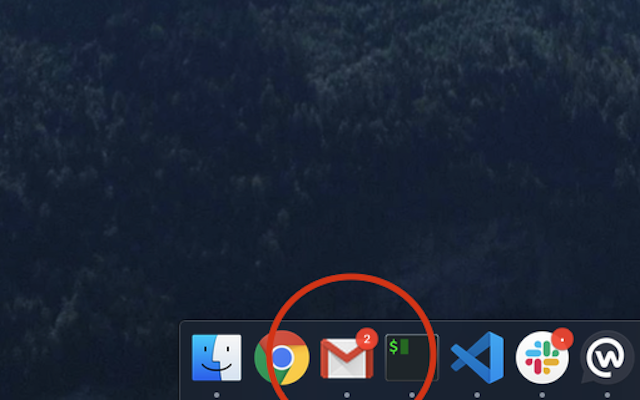
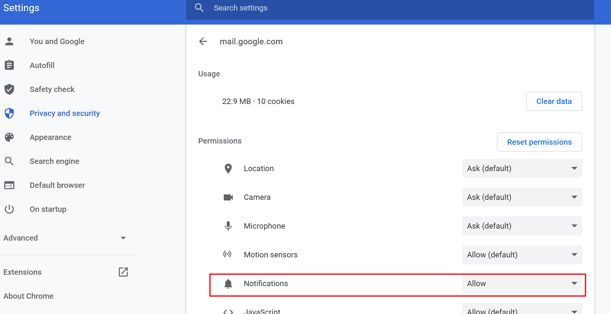
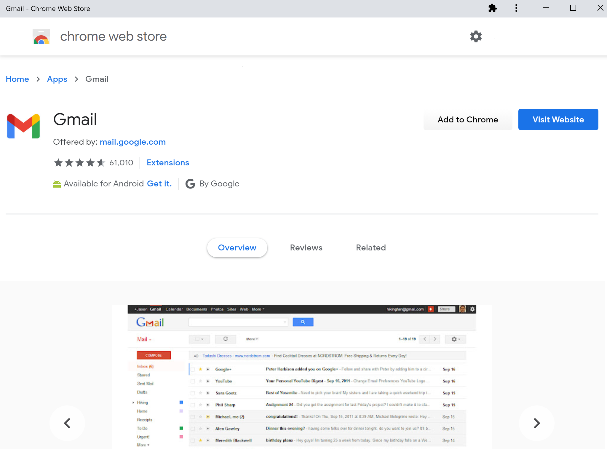

# Gmail app badge notification

You can download this extension [here](https://chrome.google.com/webstore/detail/gmail-app-badge-notificat/fbaolhbfbmniffcokakochjjeccpcpkh).

## Setup

1. Install the extension.
2. Add Gmail as an app. You can do so by following [this guide](https://support.google.com/chrome_webstore/answer/3060053?hl=en). **Make sure to select the option "open as a window".**
3. Open the newly installed app.

## Troubleshooting

The extension hasn't been heavily tested. If you are experiencing any problems, please [open an issue](https://github.com/aberonni/gmail-app-badge-notification/issues/new).

#### Previous apps

If you already had a Gmail app, you might have to remove it and add it again. You can do so from the [chrome://apps](chrome://apps) page.

#### Notifications

You might have to manually enable notifications for the app. You can do so from the [chrome://apps](chrome://apps) page. Right click on the app you previously created and select "App info". Under "Privacy and security" settings, make sure to allow notifications.

#### Gmail from the app store

This extension does not work with the Gmail app downloaded from the web store. Make sure to follow the steps outlined in [Setup](#Setup) to install your app. **Do not install the app displayed below.**

